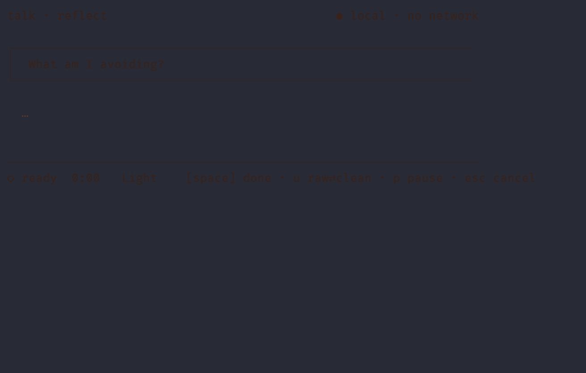

# talk

A terminal listening companion — speak a reflection, and your words settle into a
quiet file, right where you already work. Open it between meetings, answer one
question aloud, and let the day put a sentence down without reaching for your phone.

[](https://github.com/walktalkmeditate/talk-cli/releases)
[](https://github.com/walktalkmeditate/talk-cli/actions/workflows/ci.yml)
[](LICENSE)



*A real session: the dim line is the live edge — your words as you speak — settling
into the bright, final text above. Press `space` and it lands in `~/talk/`.*

The third pillar of **Walk · Talk · Meditate**, in the terminal. Sibling to
[`meditate`](https://github.com/walktalkmeditate/meditate-cli) (breathe) — this one
is **talk** (reflect). `meditate` gave the terminal a breath; `talk` gives it an ear.

## What it is (and isn't)

- **Is:** voice reflection in the terminal. It speaks a question, you answer aloud,
  it transcribes **entirely on-device**, and the words settle into a markdown file
  you can return to. Voice in, peace out.
- **Is not:** a dictation tool. Not system-wide "type into any app," not a
  productivity gadget. That corner is crowded and off-ethos. See
  [`DREAMING.md`](./DREAMING.md) for the path we chose and why.

## Install

**Homebrew (macOS / Linux)**

```sh
brew install walktalkmeditate/tap/talk
```

**Cargo (crates.io)** — the crate is `talk-cli`; the command it installs is `talk`.

```sh
cargo install talk-cli
```

**One-line installer (macOS / Linux)**

```sh
curl -fsSL https://raw.githubusercontent.com/walktalkmeditate/talk-cli/main/install.sh | sh
```

**From source** (Rust 1.82+)

```sh
cargo install --path .
```

On Linux, the bundled audio needs the ALSA dev headers (`libasound2-dev` on
Debian/Ubuntu); macOS needs nothing extra. **Windows isn't supported yet** — talk's
privacy model leans on Unix file permissions, so a Windows port is on the roadmap.

**First run** fetches the on-device speech models (~330 MB — a streaming recognizer
for the live edge plus Whisper base.en to finalize each phrase). talk offers to
download them the first time you listen, or fetch them up front:

```sh
talk download models     # fetch the models now
talk download            # list what's installed
talk download verify     # re-check every model against its pinned checksum
```

## Use

```sh
talk                       # reflect: it asks a question, then listens (default)
talk "what am I avoiding?"  # bring your own question
talk journal               # freeform daily journal — no prompt
talk unburden              # ephemeral — listens, shows, keeps nothing (alias: vent)
talk thread                # list your threads
talk thread "what am I avoiding?"   # print one question's accumulated file
talk streak                # your reflection streak
talk config                # config helpers (config init · config path)
```

**While it's listening:** `space` done · `p` pause (goes off-record — nothing said
while paused is kept) · `u` toggle raw ⇄ cleaned text · `esc` or `Ctrl-C` cancel.

**The four ways to talk:**

- **`talk` (reflect)** — draws a question from a curated spine, then listens. Answers
  to the *same* question accumulate into one file over time, so a recurring prompt
  becomes a thread you can read back. Some questions are *held* — they stay with you
  across several days (`held 3 days`).
- **`talk journal`** — no question, just a freeform entry appended under today's date.
- **`talk unburden`** (or **`vent`**) — say it once and let it go. Nothing is written;
  the transcript buffers are wiped when the session ends.
- **`talk "your own question"`** — bring your own. If it's close to one you've asked
  before, talk offers to continue that thread.

## How it works

Two passes, both on-device. A streaming recognizer paints the live edge the instant
you speak — that's the dim, jittering line. When you pause, that phrase commits and
**Whisper base.en** refines it into final text: properly cased, punctuated, and locked
bright. Light cleanup trims filler ("um", "uh") without rewriting your words — press
`u` any time to see the verbatim transcript behind the cleaned one.

Reflections land in **`~/talk/`** as plain markdown — reflect questions accumulate
into per-question files, journal entries into dated files. Every file is yours, in a
directory only you can read. Config lives in `~/.config/talk` (`talk config path`
prints it); your streak and state sit in `~/.local/share/talk` — so `~/talk` stays
purely your reflections. (Both honor `$XDG_CONFIG_HOME` / `$XDG_DATA_HOME`.)

## Privacy

No account, no telemetry, no background network. A listening session makes **zero**
network calls — the only request talk ever sends is a model download you explicitly
ask for. Transcription runs entirely on your machine. Your talk directory is created
`0700` and every reflection is written `0600` (owner-only). **Unburden keeps nothing**
— its buffers are zeroized on exit. The first time you keep a reflection, talk says all
of this once, then gets out of the way.

## License

MIT. A gift to the terminal community — and a quiet door to the
[Pilgrim](https://pilgrimapp.org) app if you'd like to keep walking with it.

<sub>The demo above is a real session. talk's live edge is microphone-driven, so it
can't be scripted like a typed-command demo — it's captured through a local
speaker→mic loopback (`demo/record.py`) and rendered to a GIF with
[agg](https://github.com/asciinema/agg): `agg demo/talk.cast demo/talk.gif`.</sub>

---

*Part of [momentmaker](https://github.com/momentmaker) · the
[walktalkmeditate](https://github.com/walktalkmeditate) pilgrimage.*
