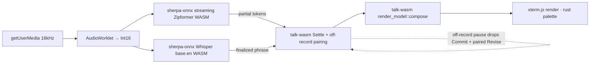

# feat: talk for the web (talk.pilgrimapp.org)

## Summary

Build `talk-web` — a fully on-device, privacy-first voice-reflection web app served at
`talk.pilgrimapp.org` — by mirroring the sibling `meditate-cli/web` toolchain (vanilla
TypeScript + xterm.js + Vite, with pure Rust compiled to WASM) and reproducing the talk CLI's
two-pass ASR (streaming Zipformer live edge + Whisper base.en finalize) through sherpa-onnx's
Emscripten/WASM build. The work is **phased and spike-first**: a feasibility spike validates
in-browser ASR latency, the true model footprint, the production-CSP loadability, and the
single-threaded-SIMD/no-COOP-COEP bet — selecting which downstream branch the build takes —
before the production build commits to it.

---

## Problem Frame

talk has no web front door — the only way to experience it is to install and compile a Rust
CLI. Its siblings (walk, meditate) already meet people on the web. The hard part is that
talk's engine is on-device speech recognition and its identity is "nothing leaves your
machine," so the web port must run a genuine ASR pipeline in the browser rather than reaching
for cloud STT. Full context, actors, flows, and product decisions live in the origin doc
(see Sources & References).

---

## Requirements

Traceability to the origin requirements doc (R-IDs are origin's):

- R1. In-browser capture + transcription; after the one-time model download, zero network
  calls and nothing leaves the device.
- R2. Two-pass pipeline (streaming Zipformer edge + Whisper base.en finalize) via sherpa-onnx
  WASM.
- R3. Live edge: dim partials settle into bright final text; defined idle/silence behavior.
- R4. Session controls mirror the CLI (done · pause/off-record · raw⇄clean · cancel);
  keyboard on desktop, chip bar on mobile.
- R5. Up-front, precisely-worded privacy assertion.
- R6. Zero-egress enforced + verifiable: self-hosted assets, strict CSP.
- R7. Model integrity: HTTPS from a named host, SHA-256 verified before cache and on load;
  refuse-not-run on mismatch.
- R8. Full mic-permission state coverage (pending / granted / denied / denied-suppressed /
  device-unavailable).
- R9. One-time model download (~330 MB) with progress, cancel, and defined sub-states.
- R10. "Taste it first" preview before/while downloading.
- R11. Cached models → instant subsequent visits.
- R12. Graceful download recovery; never a corrupt model; clean re-download on eviction.
- R13. Defined offline states.
- R14. Reflect front door: curated question as on-screen text (no TTS); returnable thread.
- R15. Journal mode (freeform).
- R16. Unburden mode (ephemeral, closure moment, buffer wipe).
- R17. Mode-switching UX defined.
- R18. Private, browser-local journal you return to.
- R19. Journal information architecture (by date + by reflect-thread; empty state; continue).
- R20. Markdown export (download + clipboard with disclosure); defined entry point.
- R21. Durability honesty (export prompt on first keep; private-mode + eviction warnings).
- R22. At-rest shared-device warning.
- R23. Storage-failure states.
- R24. Cleanup parity (clean/raw toggle + deterministic paragraphs; journal=high, reflect=light).
- R25. talk's rust palette + themes (rust / high-contrast / mono).
- R26. meditate-web aesthetic + structure; OG card; install funnel; `talk.pilgrimapp.org`.
- R27. Mobile in v1, contingent on the latency spike; Moonshine mobile finalizer fallback.

**Origin actors:** A1 (first-time visitor), A2 (returning reflector), A3 (existing CLI user).
**Origin flows:** F1 (first visit + download), F2 (reflect session), F3 (journal session),
F4 (unburden session), F5 (return / re-read / export).
**Origin acceptance examples:** AE1–AE11 (mapped to test scenarios in the relevant units).

---

## Scope Boundaries

- Personal lexicon corrections — deferred (clean/raw + paragraphs still ship). Note:
  `talk-core::lexicon` is WASM-clean, so re-enabling later is cheap.
- Optional at-rest passphrase encryption — deferred; v1 ships the shared-device warning (R22).
- WebGPU desktop tier (transformers.js / Moonshine Streaming) — deferred. The related mobile
  Moonshine finalizer is in v1 scope *only if* the U1 spike shows base.en can't keep up.
- Accounts, cloud sync, cross-device sync, any backend — out (off-ethos). Export is the only
  bridge off-device.
- Web Speech API / cloud STT — rejected (breaks the privacy promise).
- Audio soundscapes / voice-guide / breathing-orb / favicon-orb — meditate-specific, N/A.
- Importing existing CLI `~/talk` entries into the web journal — out (export is one-way).
- The talk CLI itself — unchanged.

### Deferred to Follow-Up Work

- OG social-card final artwork (rust): the build wires `web/public/og.jpg` (a placeholder ships
  so the Pages build and OG meta resolve); producing the pixel-perfect card is a design
  follow-up (the meditate cards are hand-rendered + screenshot).

---

## Context & Research

### Relevant Code and Patterns

**Mirror from `meditate-cli` (sibling repo; paths rooted at `meditate-cli`):**
- `web/package.json`, `web/vite.config.ts` (`vite-plugin-wasm` + `vite-plugin-top-level-await`,
  `base: '/'`), `web/tsconfig.json` — the exact toolchain.
- `web/scripts/build-wasm.sh` — reads the pinned `wasm-bindgen` version from the wasm crate's
  `Cargo.toml` via `sed`, verifies the CLI version matches, builds with
  `RUSTFLAGS="-C panic=abort" cargo build --release --target wasm32-unknown-unknown`, runs
  `wasm-bindgen --target web --out-dir web/src/wasm`, optional `wasm-opt -Oz`.
- `crates/meditate-wasm/src/lib.rs` — the single-`#[wasm_bindgen] struct` façade pattern
  (depends only on `meditate-core`), with `#[wasm_bindgen(js_name = …)]` camelCase and
  panic-safe boundary inputs.
- `.github/workflows/pages.yml` — Pages deploy (toolchain 1.82 + wasm target, `cargo binstall
  wasm-bindgen-cli@<pin>`, node 20, `npm ci && npm run build`, upload `web/dist`). No committed
  CNAME (domain set in Pages settings).
- Reusable web modules to port: `web/src/terminal.ts` (xterm + WebGL fallback),
  `web/src/repl.ts` (pure tested line editor), `web/src/loop.ts` (`requestAnimationFrame` +
  `frameSequence` synchronized output), `web/src/store.ts` (versioned-blob localStorage,
  corrupt-safe load), `web/src/deeplink.ts` (hash routing + `SAFE_ID`/`neutralize`
  sanitization), `web/src/mobile.ts` (`isTouch` + `createChipBar`), `web/src/boot.ts`,
  `web/src/ansi.ts` (where the accent color is hard-coded — replace with rust),
  `web/src/style.css` (safe-area chip bar). `web/.gitignore` ignores `src/wasm/`.

**Port concepts from `talk-cli` (this repo):**
- `crates/talk-core/` is **WASM-clean** — only `serde` + `toml` deps, zero `std::fs/env/io/
  process/thread`, no system clock (time injected). Pure modules to compile: `cleanup.rs`
  (`shape_entry`, `paragraphize`, `deterministic_light`, `strip_sound_tags`, `Level`),
  `entry.rs` (`append` — the `## HH:MM` + `\n\n---\n\n` divider + `<!-- raw: -->` rendering),
  `palette.rs` (`RUST`, `Theme`, `palette()`), `settle.rs` (the `Settle` live/committing/
  settled machine), `render_model.rs` (`compose` → `(line, LineKind)` pairs), `questions.rs`
  + `selection.rs` + `clock.rs` (curated question set + rotation, `serde`/`toml`).
- `src/download/models.rs` — the model manifest. The CLI verifies two `.tar.bz2` archives AND
  the **seven EXTRACTED files** the session actually loads (the archive hash alone doesn't cover
  post-extraction tampering; `tests/privacy.rs` proves the extracted-file layer independently).
  The web ports the *verify-extracted-files contract*; the SHA values are re-derived for the
  served WASM artifacts (see Key Technical Decisions).
- `src/live.rs` (`run_loop`/`apply_event`) + `src/keymap.rs` — the interaction logic to
  reproduce: keys (space/u/p/esc), the **off-record pause Commit/Revise pairing guards** (arm
  order is load-bearing), finish drain, `SPEECH_HANGOVER` idle latch. The crossterm/threads
  wiring does not port; the pairing *state machine* is lifted into `talk-core` (U3) so it
  compiles into WASM and is shared-tested rather than re-implemented in TS.
- `src/config.rs::cleanup_for(mode)` — journal→high, reflect→light defaults.

### Institutional Learnings

(`docs/solutions/` does not exist; learnings live in `docs/superpowers/` + `.wolf/`.)
- **Integrity contract** (`docs/superpowers/plans/2026-06-09-talk-cli-plan4-packs-privacy.md`):
  verify-before-load, refuse-not-run on mismatch, and **two-source corroboration** — pin SHA
  from one source but cross-check an independent mirror, because a single-source pin "is not
  enough for weights that run on private audio." (Adapted for self-hosting in Key Technical
  Decisions: pin upstream *before* uploading to the CDN, then verify the served bytes match.)
- **No-egress is provable, not asserted** (`tests/privacy.rs`): the CLI gates the privacy
  promise with a deny-network sandbox + a **canary** that asserts the blocker actually blocks.
  Web analogue: a Playwright net-silence assertion after the model-cache phase, wired in
  Phase C (not Phase E) so it guards every later unit.
- **Redirect trap** (`docs/superpowers/plans/2026-06-10-talk-cli-whisper-base-pass2.md`): both
  GitHub release assets and HF `resolve/main` URLs 302-redirect; self-hosting on one CDN host
  sidesteps the redirect *and* shrinks the CSP `connect-src` to a single origin.
- **Whisper hallucination guard** (`docs/superpowers/specs/2026-06-10-talk-cli-whisper-threaded-pass2-design.md`):
  Whisper invents text on silence — keep an energy/duration `plausibly_speech` gate (or
  threshold `no_speech_prob` if the WASM build exposes it) before finalizing, or the live edge
  fabricates words during pauses (directly relevant to R3 idle states).
- **Palette hierarchy** (`docs/superpowers/specs/2026-06-10-talk-cli-palettes-design.md`):
  settled words = `core` (brightest), question + live edge = `dim`, chrome = `edge`; triples
  are WCAG-validated (≥4.5:1 core, ≥3:1 dim/edge) — keep the contrast assertion in CSS.

### External References

External ASR grounding was gathered during the brainstorm (sherpa-onnx WASM has maintained
streaming-Zipformer + offline-Whisper/Moonshine browser demos; Cache API/OPFS for large model
caching; AudioWorklet at 16 kHz; WebGPU/Moonshine as the mobile fallback). Re-confirm exact
WASM model artifacts and the Emscripten loader's CSP requirements at U1 spike time.

---

## Key Technical Decisions

- **WASM façade = new `crates/talk-wasm` depending only on `talk-core`** (mirrors
  `meditate-wasm`). It exposes the pure cleanup/entry/palette/settle/render_model/question
  surface to JS — **plus the off-record Commit/Revise pairing state machine** (lifted into
  `talk-core` in U3). The Rust `sherpa-onnx`/`cpal`/`libc` listen path is NOT ported (cannot
  target wasm32); audio/ASR run through sherpa-onnx's own Emscripten WASM build via fresh JS
  bindings.
- **ASR engine = sherpa-onnx Emscripten/WASM via JS bindings** — same models/algorithms as the
  CLI (algorithmic parity), not the Rust crate.
- **Finalizer = Whisper base.en for accuracy/self-punctuation** (the reason the CLI adopted it),
  with the Moonshine mobile finalizer as the spike-gated fallback (R27).
- **Off-record pairing lives in `talk-core`, not TS.** The privacy-critical drop-while-paused /
  disarm-paired-Revise logic is lifted from `src/live.rs::apply_event` into a pure `talk-core`
  state machine compiled into `talk-wasm`; the JS pipeline is a thin driver. This closes the
  cross-language drift the cleanup-parity decision otherwise reopens, and lets the CLI's
  existing Commit/Revise/pause test vectors run against the shared logic.
- **Served model form = the individual extracted files** (the seven `.onnx`/`.txt` in
  `models.rs` EXTRACTED), hosted directly on the CDN — **not** the `.tar.bz2` archives (browsers
  have no native bz2/tar, and sherpa-onnx WASM loads files into its Emscripten FS). The exact
  filename set sherpa-onnx WASM expects is confirmed at U1.
- **Model hosting = the existing `cdn.pilgrimapp.org` R2** (the bucket meditate already uses
  for audio), HTTPS, one CSP-allowed host. *Forced by GitHub's 100 MB per-file limit — the
  ~199 MB Whisper artifact cannot live in the Pages repo* — and it dodges the k2-fsa/HF
  302-redirect trap. CDN CORS must be locked to the exact origin `https://talk.pilgrimapp.org`
  (not `*`), and configured for ranged GETs so per-file resume works.
- **Model integrity** = per-file SHA-256 (the EXTRACTED pins, ported verbatim) verified after
  fetch AND on every cache load against the file the WASM module actually reads; mismatch
  refuses the model and re-downloads. **Corroboration adapted for self-hosting:** pin each
  artifact at its upstream source (k2-fsa release / HF mirror) *before* uploading to R2, then
  assert the R2-served bytes match that upstream pin — R2 is the served origin, upstream is the
  independent corroborator.
- **Storage = Cache API or OPFS** (decided at U1 by measured write performance) with
  `navigator.storage.persist()` opt-in; avoid IndexedDB for the large blobs. Hashing a ~199 MB
  file via `crypto.subtle.digest` may need chunked/streaming hashing on mobile — confirmed at U1.
- **Single-threaded SIMD WASM path** → no SharedArrayBuffer → no COOP/COEP → static GitHub
  Pages hosting works. meditate-web validates the **static-Pages toolchain and the no-COOP/COEP
  page** — NOT ASR inference latency (its WASM is a 41 KB breath engine that loads no model).
  Whether single-threaded SIMD inference of a 199 MB Whisper model is fast enough is exactly
  what U1 measures; threads (COOP/COEP + a header shim or non-Pages host) are the fallback only
  if it isn't — and that fallback cascades (see Risk Analysis decision tree).
- **CSP must accommodate the Emscripten loader.** A strict CSP (`default-src 'self'`,
  `connect-src 'self' https://cdn.pilgrimapp.org`) likely needs `script-src 'self'
  'wasm-unsafe-eval'` and `worker-src 'self' blob:` for the sherpa-onnx WASM loader. The exact
  directive set is measured at U1 (loading under a draft CSP on Pages), documented as accepted
  relaxations in U10, and the net-silence canary independently verifies `connect-src` regardless.
- **Cleanup parity via `talk-core`→WASM**, not a TS reimplementation (avoids drift; `talk-core`
  is confirmed WASM-clean). TS reimpl is the fallback only if the façade proves impractical.
- **Deep-link = `#q=<question-id>` only** (hash fragment, Pages-safe), reusing meditate's
  `SAFE_ID`/`neutralize` sanitization; private words never enter a URL.
- **Single-source version pin** for `wasm-bindgen` read by the build script (mirrors meditate),
  with the Pages workflow pin kept in sync; the CI install is hash/lock-verified (U12).

---

## Open Questions

### Resolved During Planning

- *How to host ~330 MB given GitHub's 100 MB file limit?* → `cdn.pilgrimapp.org` R2, serving
  the individual extracted files, one CSP-allowed host with exact-origin CORS.
- *Archive hash vs per-file hash?* → per-file (the EXTRACTED pins); the archive layer is dropped
  since the CDN serves extracted files.
- *Two-source corroboration with a single self-hosted origin?* → pin upstream before upload,
  verify the R2 copy matches.
- *Off-record pairing — TS reimpl or WASM?* → lift the pure state machine into `talk-core`.
- *Compile `talk-core` to WASM or reimplement cleanup in TS?* → compile to WASM.
- *Does the settle/pairing model need threads?* → no; it coincides with the user's pause.
- *Deep-link shape?* → `#q=<question-id>` only.

### Deferred to Implementation

- **[validate early · U1 go/no-go]** True post-int8-quantization WASM footprint; Cache-API-vs-
  OPFS choice; whether `crypto.subtle.digest` needs chunked hashing for the ~199 MB file.
- **[validate early · U1 go/no-go]** Mobile real-time factor for Whisper base.en finalize, and
  the latency bar below which the Moonshine mobile finalizer ships.
- **[validate early · U1 go/no-go]** Does the sherpa-onnx Emscripten loader run under the draft
  strict CSP on Pages (which directives does it require), and is single-threaded latency
  acceptable on desktop — selecting the build branch (see Risk Analysis decision tree).
- **[U6]** Whether the sherpa-onnx WASM ships the streaming + offline recognizers as one module
  or two co-loaded; whether it consumes ArrayBuffers from Cache/OPFS or needs files staged into
  the Emscripten MEMFS; whether it exposes `no_speech_prob` for the hallucination gate.
- **[U9]** The journal store schema-version migration contract (mirror meditate's `store.ts`).

---

## Output Structure

    talk-cli/
      crates/
        talk-wasm/                  # NEW — wasm-bindgen façade over talk-core
          Cargo.toml
          src/lib.rs
      web/                          # NEW — the talk-web app (mirrors meditate-cli/web)
        package.json
        vite.config.ts
        tsconfig.json
        index.html                  # rust theme + OG/meta + CSP, talk.pilgrimapp.org
        .gitignore                  # ignores src/wasm/
        scripts/
          build-wasm.sh
          og.html                   # rust OG-card source (screenshot → public/og.jpg)
        public/
          favicon.svg
          og.jpg                    # placeholder until the design follow-up
        src/
          main.ts                   # orchestration / wiring (+ inline taste-it preview)
          terminal.ts  repl.ts  loop.ts        # ported from meditate-web
          theme.ts                  # rust palette (replaces meditate's ansi.ts moss)
          style.css
          boot.ts  mobile.ts  deeplink.ts
          wasm/                     # generated by build-wasm.sh (gitignored)
          asr/
            download.ts             # fetch + progress + resume
            integrity.ts            # per-file SHA-256 verify (download + load)
            cache.ts                # Cache API / OPFS store
            audio.ts                # getUserMedia 16kHz + AudioWorklet
            pipeline.ts             # streaming edge + Whisper finalize + settle/pairing driver
          session/
            controls.ts             # keys + chip-bar commands, raw/clean toggle
            modes.ts                # reflect / journal / unburden
          journal/
            store.ts                # versioned-blob persistence (entries + threads)
            view.ts                 # journal IA: by-date + by-thread, empty state
            export.ts               # markdown export (download + clipboard)
        tests/
          *.test.ts                 # vitest unit tests
          no-egress.spec.ts         # Playwright net-silence canary (e2e, wired in Phase C)
      .github/workflows/pages.yml   # NEW — Pages deploy
      Cargo.toml                    # MODIFY — add crates/talk-wasm to workspace members

---

## High-Level Technical Design

> *This illustrates the intended approach and is directional guidance for review, not
> implementation specification. The implementing agent should treat it as context, not code to
> reproduce.*

Two-pass audio path and the settle/render flow the live edge reproduces:

Module/data ownership: **Rust→WASM (`talk-wasm`)** owns the deterministic text logic *and the
privacy-critical off-record pairing* (settle state, drop-while-paused/disarm-paired-Revise,
paragraphize/cleanup, journal/reflect append format, palette, question selection). **JS/TS**
owns everything the browser must do: audio capture, the sherpa-onnx ASR module(s), model
download + integrity + caching, persistence, the terminal/REPL/render loop, and chrome. The
boundary mirrors meditate-web: JS crosses into WASM for small deterministic transforms; the
heavy ASR is its own WASM module driven from JS.

---

## Implementation Units

Grouped into five phases (see Phased Delivery). U-IDs are stable.

### U1. ASR feasibility, footprint & CSP-loadability spike (de-risk before building)

**Goal:** Prove the load-bearing assumptions before committing the production build, and select
the build branch: in-browser sherpa-onnx ASR works, latency is acceptable (desktop + mobile),
the true cached footprint, that the Emscripten loader runs under the production CSP on Pages,
and that single-threaded SIMD (no COOP/COEP) suffices.

**Requirements:** R2, R6, R7, R9, R27 (validation), Dependencies/Assumptions gates.

**Dependencies:** None.

**Files:**
- Create: `web/spike/` (throwaway page driving the sherpa-onnx WASM ASR demo build)

**Approach:**
- Stand up sherpa-onnx's WASM streaming-Zipformer + offline-Whisper-base.en demo against the
  real model artifacts, loaded **via its actual Emscripten loader, served from a GitHub Pages
  preview under a draft strict CSP** (`default-src 'self'; script-src 'self' 'wasm-unsafe-eval';
  worker-src 'self' blob:; connect-src 'self' https://cdn.pilgrimapp.org`).
- Measure and record (append a go/no-go memo to this plan's Open Questions before Phase C):
  (a) real-time factor for the live edge and base.en finalize on a desktop and a mid-range
  phone (Android Chrome + iOS Safari 16.4+); (b) the actual cached byte size after int8
  quantization, and whether `crypto.subtle.digest` needs chunked hashing for the ~199 MB file;
  (c) the exact CSP directives the loader requires (does it need `unsafe-eval`, blob workers,
  a `.data` fetch widening `connect-src`); (d) whether it runs single-threaded or needs
  SharedArrayBuffer/COOP-COEP; (e) the filename set / module count sherpa-onnx WASM expects and
  whether it consumes ArrayBuffers or needs Emscripten-FS staging.
- Decide the build branch per the Risk Analysis decision tree (base.en vs Moonshine on mobile;
  single-threaded vs threaded; two-pass vs single-pass Zipformer-only if base.en is slow on
  desktop too) and the Cache-vs-OPFS choice for U5.

**Execution note:** Throwaway spike — output is measurements + the recorded branch decision, not
production code. Do not let spike code leak into `web/src/`. Close Phase A by writing the memo
into Open Questions; no Phase C unit starts until it's recorded.

**Test scenarios:**
- Test expectation: none — spike measures feasibility; the production units carry the tests.

**Verification:**
- The go/no-go memo is recorded in Open Questions: desktop/mobile RTF, true footprint, hashing
  approach, the required CSP directive set, the threading requirement, the Cache-vs-OPFS choice,
  and the explicit branch decision (R27 finalizer; two-pass vs single-pass; single-threaded vs
  threaded host).

---

### U2. Web project scaffold (Vite + TS + xterm toolchain)

**Goal:** Stand up the `web/` app skeleton mirroring meditate-web's toolchain so every later
unit has a build to land in.

**Requirements:** R26.

**Dependencies:** None (parallel with U1).

**Files:**
- Create: `web/package.json`, `web/vite.config.ts`, `web/tsconfig.json`, `web/index.html`,
  `web/.gitignore`, `web/src/main.ts` (stub), `web/src/style.css`
- Create: `web/public/favicon.svg`

**Approach:**
- Copy meditate-web's `package.json`/`vite.config.ts`/`tsconfig.json` shape: `vite-plugin-wasm`
  + `vite-plugin-top-level-await`, `base: '/'`, `build.target: 'esnext'`, `outDir: 'dist'`,
  strict TS, `noEmit` typecheck, vitest. Drop audio/breathing deps.
- `index.html`: inline critical CSS (zero-JS calm paint), rust-themed `#screen`, OG/Twitter
  meta for `talk.pilgrimapp.org`. `.gitignore` ignores `src/wasm/`.

**Patterns to follow:** `meditate-cli/web/package.json`, `vite.config.ts`, `tsconfig.json`,
`index.html`, `web/.gitignore`.

**Test scenarios:**
- Happy path: `npm run typecheck` and `npm run build` succeed on the stub (build wired before
  WASM exists is fine — U3 adds the wasm step).
- Test expectation: none beyond build/typecheck for the scaffold itself.

**Verification:** `npm install && npm run build` produces a `web/dist/` with the placeholder page
in the rust theme.

---

### U3. `talk-wasm` façade crate (incl. off-record pairing) + build pipeline

**Goal:** Compile the pure `talk-core` surface to WASM and expose it to JS, with the pinned-version
build script mirroring meditate. Lift the off-record Commit/Revise pairing into `talk-core` so the
privacy invariant is shared, not re-implemented in TS.

**Requirements:** R3 (settle), R4 (off-record), R24 (cleanup), R25 (palette), R14 (questions).

**Dependencies:** U2.

**Files:**
- Create: `crates/talk-wasm/Cargo.toml` (`crate-type = ["cdylib","rlib"]`, deps:
  `talk-core` + `wasm-bindgen = "=<pin>"`)
- Create: `crates/talk-wasm/src/lib.rs`
- Create: `web/scripts/build-wasm.sh`
- Modify: `crates/talk-core/src/` (extract the pure Commit/Revise/pause pairing state machine
  from the logic currently in `src/live.rs::apply_event` into a pure `talk-core` module)
- Modify: `Cargo.toml` (workspace `members += "crates/talk-wasm"`)
- Modify: `web/package.json` (`build:wasm` script; `build` runs it first)
- Test: `crates/talk-core/src/<pairing>.rs` tests; `crates/talk-wasm` `rlib` tests
- Generated (gitignored): `web/src/wasm/talk_wasm*.{js,d.ts,wasm}`

**Approach:**
- First, refactor: move the pure off-record pairing logic (drop Commit while paused; disarm the
  paired pass-2 Revise; honor a straddling Revise) out of `src/live.rs` into `talk-core` with
  the existing CLI test vectors following it, leaving `live.rs` a thin caller. (This is a
  characterization-guarded refactor — see Execution note.)
- Façade `#[wasm_bindgen]` types over `talk-core`: a `Settle`/pairing wrapper (on_partial/
  commit/finalize/revise/pause/resume), `shape_entry(level, text)`, `append`-format helpers,
  `palette(theme) -> bytes`, `compose(view) -> lines`, question selection. Inputs clamped so
  nothing panics across the boundary.
- `build-wasm.sh`: read the `wasm-bindgen` pin from `crates/talk-wasm/Cargo.toml`, verify the
  CLI matches, `RUSTFLAGS="-C panic=abort" cargo build --release --target
  wasm32-unknown-unknown -p talk-wasm`, `wasm-bindgen --target web --out-dir web/src/wasm`,
  optional `wasm-opt -Oz`.

**Execution note:** Characterization-first on the pairing extraction — run the existing
`src/live.rs` Commit/Revise/pause tests against the lifted `talk-core` machine before deleting
the old path, so the privacy invariant can't regress in the move.

**Patterns to follow:** `meditate-cli/crates/meditate-wasm/src/lib.rs`,
`meditate-cli/web/scripts/build-wasm.sh`, `talk-cli/src/live.rs` (pairing arm order).

**Test scenarios:**
- Happy path (Rust): `shape_entry(High, multi_sentence)` paragraphizes identically to
  `talk_core::cleanup::paragraphize`; `append` for Journal emits `## HH:MM` with the
  `\n\n---\n\n` divider on the second same-day entry; `palette(Theme::Rust)` returns the rust
  bytes.
- Privacy path (Rust, ported vectors): a Commit (and its paired Revise) arriving while paused is
  dropped; a straddling Revise (on-record Commit, pass-2 during pause) still upgrades — the
  lifted machine matches `live.rs`'s pre-refactor behavior exactly.
- Edge case: empty/whitespace input to `shape_entry` returns empty without panic.
- Integration: `build-wasm.sh` fails loudly when installed `wasm-bindgen` ≠ the pin.

**Verification:** `npm run build:wasm` emits bindings; the pairing test vectors pass against the
`talk-core` machine; cleanup + append parity holds.

---

### U4. Terminal, REPL, render loop & rust theme

**Goal:** A working rust-themed terminal that renders `render_model::compose` output, with the
ported pure REPL and rAF loop.

**Requirements:** R3, R25.

**Dependencies:** U2, U3.

**Files:**
- Create: `web/src/terminal.ts`, `web/src/repl.ts`, `web/src/loop.ts`, `web/src/theme.ts`
- Modify: `web/src/main.ts`, `web/src/style.css`

**Approach:**
- Port `terminal.ts` (xterm + WebGL fallback) and `repl.ts` (pure line editor) from
  meditate-web; recolor the xterm theme to rust.
- `theme.ts` replaces meditate's `ansi.ts`: source the rust core/dim/edge tones from
  `talk-wasm palette()` (single source of truth, fixing meditate's TS/Rust drift). Map
  `LineKind` → tone: Settled=core, Edge/Question=dim, Chrome=edge.
- `loop.ts`: port `frameSequence` synchronized output + `shouldDraw` throttling; redraw the
  composed View as partials/commits arrive.

**Patterns to follow:** `meditate-cli/web/src/{terminal,repl,loop,ansi}.ts`;
`crates/talk-core/src/{render_model.rs,palette.rs}`.

**Test scenarios:**
- Happy path (vitest, pure): `repl` handles buffer/cursor/history/tab-completion (port
  meditate's `repl.test.ts`).
- Happy path: a fixed `compose` View renders to the expected `(text, tone)` sequence with rust
  tones; settled lines brighter than edge/question.
- Edge case: WebGL-unavailable falls back to the DOM renderer without throwing.
- Integration: theme tones satisfy the WCAG contrast assertion (≥4.5:1 core, ≥3:1 dim/edge).

**Verification:** the terminal paints a static composed reflect screen in rust; REPL tests pass.

---

### U5. Model download, integrity & cache

**Goal:** The one-time model acquisition: download with progress/cancel/resume, per-file checksum
verification on download and on load, browser caching, offline states. (The taste-it preview is
inlined in U10/main, not a separate module.)

**Requirements:** R7, R9, R11, R12, R13.

**Dependencies:** U1 (footprint + Cache/OPFS + served-form + hashing decisions), U2.

**Files:**
- Create: `web/src/asr/download.ts`, `web/src/asr/integrity.ts`, `web/src/asr/cache.ts`
- Modify: `web/src/main.ts` (first-run orchestration)

**Approach:**
- `download.ts`: fetch each **individual extracted file** from `cdn.pilgrimapp.org` with streamed
  progress (bytes + %), a cancel affordance, and resume/retry (byte-range; falls back to a clean
  full re-fetch if the CDN doesn't honor Range). Defined sub-states (R9): pre-accept;
  downloading; download-complete-before-mic; **mid-download navigate-away/return → on return,
  show a resume-or-cancel prompt with bytes-already-fetched, and auto-resume the in-flight file**.
- `integrity.ts`: per-file SHA-256 (Web Crypto `crypto.subtle.digest`, chunked if U1 found it
  necessary) verified after fetch AND on every cache load, against the file the WASM module
  actually reads; mismatch refuses + re-downloads. Pins = the EXTRACTED per-file SHAs, validated
  upstream-before-upload (see Key Technical Decisions).
- `cache.ts`: Cache API or OPFS (per U1) with `navigator.storage.persist()` opt-in; eviction →
  clean re-download (R12).
- Offline states (R13): cached+offline works with a local-only indicator; uncached+offline shows
  a "connect once" blocked state; mid-download drop pauses and resumes.

**Patterns to follow:** `talk-cli/src/download/models.rs` (the EXTRACTED per-file verification
contract); the integrity/no-egress learnings above.

**Test scenarios:**
- Happy path: a fetched file whose per-file digest matches the pin is committed to cache.
- Covers AE6. Error path: an interrupted download retried resumes (or restarts cleanly) without a
  corrupt model in cache.
- Covers AE7. Error path: a cached file whose checksum no longer matches on load is refused and
  re-downloaded (not run).
- Covers AE5. Happy path: with files cached, startup performs zero download.
- Covers AE8. Edge case: cached+offline works with the local-only indicator; uncached+offline
  shows the blocked state.
- Edge case: mid-download network loss pauses; reconnect resumes; returning mid-download shows
  the resume-or-cancel prompt with bytes-fetched.

**Verification:** first run downloads + per-file verifies + caches; second run is instant;
tampered cache is refused; offline + mid-download-return matrix behaves as specified.

---

### U6. Mic capture + two-pass ASR pipeline + settle/pairing driver

**Goal:** Real on-device transcription: 16 kHz capture → streaming live edge + Whisper finalize →
the `talk-wasm` settle/pairing machine, with the hallucination gate, idle states, and full
mic-permission handling.

**Requirements:** R1, R2, R3, R8, R27.

**Dependencies:** U3 (settle + pairing), U4 (render), U5 (models).

**Files:**
- Create: `web/src/asr/audio.ts`, `web/src/asr/pipeline.ts`
- Modify: `web/src/main.ts`

**Approach:**
- `audio.ts`: `getUserMedia` at 16 kHz mono via `AudioContext({sampleRate:16000})` + an
  AudioWorklet converting Float32→Int16; ScriptProcessorNode fallback for old Safari; handle the
  iOS audio-routing quirk. Mic-permission state machine (R8) — each state has its own screen:
  pending (waiting state behind the dialog); granted; denied (browser-specific re-enable steps +
  retry); **denied-suppressed** (no dialog appears — detect via the immediate-reject-without-
  prompt heuristic, show "Your browser has blocked the mic dialog — re-enable it in site
  settings" with per-browser guidance); device-unavailable (`NotReadableError` — distinct
  "mic in use / hardware" message).
- `pipeline.ts`: a **thin driver** over the `talk-wasm` settle/pairing machine — feed PCM to the
  sherpa-onnx streaming recognizer (partials → live edge) and, on endpoint/pause, to Whisper
  base.en (finalize); call the WASM `commit`/`revise`/`pause`/`resume` so the off-record pairing
  lives in shared Rust, not TS. Apply the `plausibly_speech` / `no_speech_prob` hallucination
  gate. Idle behavior (R3): hangover latch, `…` dot when not listening, finalize-or-drop a dim
  partial at session end.
- On mobile, use the U1-decided finalizer (base.en or Moonshine).

**Execution note:** Start with a failing integration test that drives the WASM pairing via the TS
driver for the off-record sequences — the privacy-critical path.

**Patterns to follow:** `talk-cli/src/live.rs` (finish drain, idle latch), the `talk-wasm`
pairing machine from U3, the hallucination-guard learning.

**Test scenarios:**
- Covers AE1. Happy path: speaking → dim partials updating live; pausing settles into bright
  final text.
- Covers AE2. Privacy path: driving the WASM pairing through the TS driver, off-record Commit +
  paired Revise are dropped; a straddling Revise upgrades.
- Edge case (R3): extended silence → calm `…`; session-end with a dim partial finalizes-or-drops
  per the defined rule.
- Error path (R8): denied / denied-suppressed / device-busy each show their distinct screen,
  never a hang. (Covers AE4.)
- Integration: silence/near-silence does not fabricate text (hallucination gate holds).

**Verification:** a real spoken phrase transcribes with the live edge settling; off-record speech
never reaches a kept entry; every mic-permission state is navigable.

---

### U7. Session controls (keys + chip bar) & cleanup toggle

**Goal:** The session interaction layer — CLI-parity controls on desktop and mobile, with the
mobile chip-bar contents fully enumerated, and the clean/raw toggle with paragraph parity.

**Requirements:** R4, R24.

**Dependencies:** U4, U6.

**Files:**
- Create: `web/src/session/controls.ts`, `web/src/mobile.ts`
- Modify: `web/src/main.ts`, `web/src/style.css`

**Approach:**
- Keys (desktop): space=done, p=pause/off-record, u=raw⇄clean, esc=cancel. Manage focus so keys
  fire even when the edge area isn't focused.
- **Chip bar contents, enumerated per mode** (mobile's only control surface): *reflect session* —
  done · pause · raw⇄clean · skip/new-question · cancel; *journal session* — done · pause ·
  raw⇄clean · cancel; *unburden session* — done(release) · pause · cancel; *journal view* —
  new-entry · export · back. (Skip/new-question chip wiring is shared with U8's reflect decision.)
- Clean/raw toggle renders verbatim transcript vs `talk-wasm shape_entry` output; journal
  defaults to high (paragraphs), reflect to light.

**Patterns to follow:** `talk-cli/src/keymap.rs`, `meditate-cli/web/src/mobile.ts`,
`talk-cli/src/config.rs::cleanup_for`.

**Test scenarios:**
- Happy path: each key triggers its action; each enumerated chip fires the same command on touch.
- Happy path: `u` toggles raw⇄clean; clean view for a journal entry matches `shape_entry(High,…)`.
- Edge case: pause mid-session shows off-record state; resume restores listening.
- Integration: spacebar with the edge area unfocused still triggers done (focus management).

**Verification:** a full session is drivable by keyboard and by the per-mode chip bar; clean view
paragraphizes journal entries.

---

### U8. Modes: reflect (front door), journal, unburden

**Goal:** The three experiences and how you move between them — with the reflect question UX,
mode-switch navigation, and unburden closure all specified.

**Requirements:** R14, R15, R16, R17.

**Dependencies:** U6, U7.

**Files:**
- Create: `web/src/session/modes.ts`
- Modify: `web/src/main.ts`

**Approach:**
- Reflect (default front door): present a curated question as on-screen **text** (no TTS) via
  `talk-wasm` selection (the CLI's `selection.rs` rotation — held-runs, slots). **Skip/re-roll:**
  a `new-question` chip (mobile) + an `n` key / `:skip` REPL command (desktop), available
  *before answering*; re-rolling draws the next question via the same rotation. Repeat answers to
  one question append to that question's thread.
- Journal: freeform, no question.
- Unburden: ephemeral — transcribe + show, keep nothing, then **a closure moment** rendering
  `render_model::compose_close`/`compose_released` (one of the CLI's rotated close phrases, e.g.
  "let it go" — held ~2.5 s, reduced-motion shortens), then return to the reflect door; buffers
  wiped on end.
- **Mode-switch (R17): between-session via a mode picker** shown after `done`/cancel (labels:
  *reflect · journal · unburden*, reflect default) — mid-session switching is not offered;
  instead, leaving a mode mid-session goes through cancel (which for unburden cancels immediately,
  for reflect/journal confirms discard of in-progress text). This keeps in-progress-text handling
  to the existing cancel path rather than a new mid-session swap.

**Patterns to follow:** `crates/talk-core/src/{questions.rs,selection.rs,render_model.rs}`,
`talk-cli/src/live.rs` (`CLOSE_PHRASES`, ephemeral cancel).

**Test scenarios:**
- Covers AE9. Happy path: unburden session end stores nothing, plays the closure moment, wipes
  buffers, returns to the mode picker.
- Happy path: reflect presents a question as text; `new-question`/`:skip` before answering draws
  the next; repeat answers to one question append to one thread.
- Edge case (R17): after `done`, the mode picker offers reflect/journal/unburden; cancelling a
  reflect/journal session mid-entry confirms discard of in-progress text.
- Happy path: journal entry appends under today's date with no question.

**Verification:** all three modes work end-to-end; unburden provably keeps nothing and shows
closure; reflect threads accumulate and skip/re-roll works; the between-session picker switches
modes.

---

### U9. Browser-local journal: persistence, navigation & export

**Goal:** The durable (browser-local) journal — storage with defined failure states, the journal
view IA, the export entry point, and the honesty/exposure warnings.

**Requirements:** R18, R19, R20, R21, R22, R23.

**Dependencies:** U3 (append format), U8.

**Files:**
- Create: `web/src/journal/store.ts`, `web/src/journal/view.ts`, `web/src/journal/export.ts`
- Modify: `web/src/main.ts`

**Approach:**
- `store.ts`: versioned-blob persistence (port meditate's corrupt-safe load + try/catch save +
  the schema-version migration pattern); schema = entries by local-civil-date + reflect threads
  keyed by question id. **Storage-failure states (R23), each with a distinct surface:**
  quota-exceeded → blocking "storage full — export now to keep these" prompt; persist-denied →
  advisory eviction-risk banner; write-failure → dismissible retry line in the REPL.
- `view.ts`: journal IA (by date + by reflect-thread), empty state ("no reflections yet"), and
  "continue a thread" (re-prompts that question — a thread entry's `continue` action / chip).
- `export.ts`: markdown via `talk-wasm` `append`-format (parity with `~/talk` files). **Export
  entry point:** a per-entry `export` action in the journal view + a `:export` REPL command +
  the R21 first-keep prompt links here; file download (primary) + copy-to-clipboard (secondary,
  with the OS-shared one-time disclosure). Post-export: a confirmation line naming the file.
- Durability honesty (R21): export prompt on first kept entry; detect private/incognito and warn
  nothing persists; flag eviction risk. **At-rest warning (R22):** a one-time notice on the first
  visit that has stored entries — entries are unencrypted in this browser profile, readable by
  anyone using it; the in-memory "wipe" for unburden is best-effort in a GC runtime (the provable
  guarantee is that unburden writes nothing to storage).

**Patterns to follow:** `meditate-cli/web/src/store.ts` (versioned blob + migration);
`crates/talk-core/src/entry.rs` (append format); `crates/talk-core/src/frontmatter.rs`.

**Test scenarios:**
- Happy path: a kept entry persists and reloads across a simulated revisit; corrupt blob loads as
  empty without throwing; a schema-version bump migrates cleanly.
- Covers AE10. Happy path: export (per-entry action and `:export`) produces markdown matching the
  `entry::append` format; first kept entry surfaces the export prompt; post-export confirms.
- Covers AE11. Edge case: private/incognito keep warns nothing persists.
- Error path (R23): quota-exceeded shows the blocking export-now prompt; persist-denied shows the
  advisory banner; write-failure shows the retry line.
- Happy path (R19): journal view groups by date and by thread; empty state renders; "continue"
  re-prompts the thread's question.

**Verification:** entries survive revisits, export matches CLI format from a defined entry point,
and every loss/exposure/storage-failure path surfaces distinctly.

---

### U10. Zero-egress enforcement + privacy chrome + canary (wired in Phase C)

**Goal:** Make the privacy promise enforceable and provable early: self-hosted assets, the
U1-derived strict CSP, the up-front assertion, the inlined taste-it preview, and a net-silence
e2e test that guards every later unit.

**Requirements:** R1, R5, R6, R10.

**Dependencies:** U2, U5 (model host known). **Wired in Phase C, immediately after U5**, so
egress introduced by U6–U9 is caught as it lands.

**Files:**
- Create: `web/tests/no-egress.spec.ts` (Playwright)
- Modify: `web/index.html` (CSP meta + privacy copy), `web/vite.config.ts` (self-host config),
  `web/package.json` (Playwright devDep + e2e script), `web/src/main.ts` (inline taste-it preview)

**Approach:**
- Self-host all fonts/scripts/assets (no third-party CDNs/analytics/error-reporting). Strict CSP
  using the **directive set U1 measured** — baseline `default-src 'self'; connect-src 'self'
  https://cdn.pilgrimapp.org`, plus the documented accepted relaxations the Emscripten loader
  needs (expected: `script-src 'self' 'wasm-unsafe-eval'; worker-src 'self' blob:`). Each
  relaxation is named and justified in a CSP comment. (CSP via `<meta http-equiv>`; note Pages
  can't set `frame-ancestors`/headers — clickjacking of the mic button is a documented residual.)
- Up-front privacy assertion (R5): "after a one-time model download, nothing you say or write
  leaves your browser," shown once.
- **Taste-it preview (R10), inlined** in `main.ts`/`boot.ts` (not a separate module): canned
  partial strings fed into the U4 loop so the real settle render path shows the live-edge jitter
  during/ before download; transitions to the real session once models are ready.
- Net-silence **canary** (port the CLI's discipline): a Playwright test that loads the app, caches
  models, runs a (mocked-audio) session, and asserts **zero** network requests after the
  model-cache phase — plus a canary sub-assertion that the interceptor actually catches a
  deliberate probe ("or the test proves nothing"). Independent of `script-src`, it verifies
  `connect-src` egress specifically, so a CSP weakened to allow `wasm-unsafe-eval` doesn't blind it.

**Patterns to follow:** `talk-cli/tests/privacy.rs` (sandbox + canary discipline).

**Test scenarios:**
- Covers AE3. Integration (Playwright): after model caching, a session fires zero network
  requests (no audio, no text, no third-party).
- Integration: the canary probe is caught by the interceptor (proves the assertion is live).
- Edge case: CSP blocks an injected external `connect`/`script`/`font` attempt while the
  Emscripten loader still initializes under the accepted relaxations.

**Verification:** the e2e net-silence test (with a live canary) passes from Phase C onward; the
ASR engine loads under the production CSP; CSP rejects external egress.

---

### U11. Look, feel & reach (boot, deep-link, OG, install funnel)

**Goal:** The meditate-web chrome, recolored rust, plus question deep-linking and the install
funnel.

**Requirements:** R25, R26.

**Dependencies:** U4, U8.

**Files:**
- Create: `web/src/boot.ts`, `web/src/deeplink.ts`, `web/scripts/og.html`, `web/public/og.jpg`
- Modify: `web/src/main.ts`, `web/index.html`, `web/src/style.css`

**Approach:**
- Port `boot.ts` (login-style banner over an MOTD) and `deeplink.ts` (hash routing) — restrict
  to `#q=<question-id>`, reusing `SAFE_ID`/`neutralize` sanitization (the security-relevant moat,
  since a hash drives an on-screen question and mic transcript is attacker-adjacent). The
  deep-link work can land independently of the OG artwork.
- Soft install funnel to `brew install talk`. Rust OG card (`og.html` → screenshot →
  `public/og.jpg`); a placeholder `og.jpg` ships now so the build + OG meta resolve (final
  artwork is a design follow-up). OG/Twitter meta in `index.html`.

**Patterns to follow:** `meditate-cli/web/src/{boot,deeplink}.ts`,
`meditate-cli/web/scripts/og*.html`.

**Test scenarios:**
- Happy path: a valid `#q=<id>` opens that reflect question; an invalid/oversized hash is
  neutralized and ignored.
- Edge case: control/ESC bytes in the hash are stripped before reaching the terminal.
- Test expectation: OG final artwork is visual (deferred to follow-up); only the meta wiring +
  placeholder are tested.

**Verification:** boot banner + deep-link + install funnel work; deep-link input is sanitized.

---

### U12. Deploy: GitHub Pages workflow

**Goal:** Ship `talk-web` to `talk.pilgrimapp.org` via GitHub Pages, mirroring meditate's
workflow, with a hardened CI install.

**Requirements:** R26.

**Dependencies:** U2–U11 (a buildable app).

**Files:**
- Create: `.github/workflows/pages.yml`

**Approach:**
- Mirror meditate's `pages.yml`: trigger on push to `main` touching `web/**`,
  `crates/talk-wasm/**`, `crates/talk-core/**`, or the workflow; toolchain 1.82 + wasm target;
  install `wasm-bindgen-cli@<pin>` **with a binary hash / `--locked` verification** (kept in sync
  with the crate pin); node 20; `npm ci && npm run build`; upload `web/dist`; deploy-pages. No
  committed CNAME — set `talk.pilgrimapp.org` in Pages settings.
- Document the user-owned ops: DNS `CNAME talk → <org>.github.io`; Pages custom-domain setting;
  upload the pinned extracted model files to `cdn.pilgrimapp.org` (verified upstream-before-
  upload); **CDN CORS set to `Access-Control-Allow-Origin: https://talk.pilgrimapp.org` (exact
  origin, not `*`), with `Accept-Ranges` + `Access-Control-Expose-Headers: Content-Range` so
  per-file resume works**. If the shared R2 bucket also serves meditate audio, use per-prefix
  CORS so talk's prefix is exact-origin.

**Patterns to follow:** `meditate-cli/.github/workflows/pages.yml`.

**Test scenarios:**
- Test expectation: none (CI/deploy config). Verified by a successful Pages run on a branch.

**Verification:** the workflow builds + deploys; the site loads at the Pages URL (custom domain
after DNS); the CDN serves the models with exact-origin CORS + Range.

---

## System-Wide Impact

- **Interaction graph:** new `web/` app + new `crates/talk-wasm`; `talk-core` gains a second
  consumer (the WASM façade) AND a new pure pairing module lifted from `src/live.rs` (the CLI is
  refactored to call it — behavior-preserving, characterization-guarded in U3). The new Pages
  workflow is independent of the existing release/CI workflows.
- **Error propagation:** ASR/model/storage failures surface as defined UI states (download, mic,
  offline, storage) rather than throwing; the settle/off-record invariants are the highest-risk
  correctness path and now live in shared, tested Rust.
- **State lifecycle risks:** the ~330 MB cache + growing journal share the origin's storage quota
  (eviction → re-download); off-record pause must not leak into kept entries (shared WASM guard).
- **API surface parity:** journal/reflect markdown matches `talk-core::entry::append` so exported
  files drop cleanly into a real `~/talk`/Obsidian vault.
- **Integration coverage:** the off-record pairing (via the TS driver over WASM), the no-egress
  canary, and the per-file checksum-refuse path are integration-level.
- **Unchanged invariants:** the talk CLI's *behavior*, `talk-core`'s public cleanup/entry/palette
  output, and the existing release pipeline are untouched (the pairing lift preserves CLI behavior).

---

## Risks & Dependencies

| Risk | Mitigation |
|------|------------|
| Mobile Whisper base.en latency unacceptable (highest risk) | U1 measures it first; R27 ships the Moonshine mobile finalizer in v1 if needed |
| base.en too slow on desktop too | U1 branch decision → single-pass Zipformer-only v1 shape (see decision tree) |
| Single-threaded SIMD too slow → needs threads | U1 confirms; if threads needed → COOP/COEP + non-Pages host (cascades U10/U12 — see decision tree). meditate proves only the hosting/toolchain, NOT ASR inference latency |
| Strict CSP breaks the Emscripten loader | U1 loads under a draft CSP on Pages and records required directives; U10 uses that exact set; canary verifies connect-src independently |
| ~199 MB model > GitHub's 100 MB file limit | Serve individual extracted files from `cdn.pilgrimapp.org` R2, not the Pages repo |
| Off-record speech leaks into a kept entry | Pairing lifted into shared `talk-core` (WASM), CLI test vectors follow it; TS is a thin driver |
| CDN CORS wildcard exposure | Exact-origin CORS (`https://talk.pilgrimapp.org`), documented as a go-live gate (U12) |
| Per-file resume degrades to full re-fetch | Configure R2 ranged GETs + expose `Content-Range`; else fall back to clean re-fetch |
| Zero-egress regresses via a transitive dep | Strict CSP + the net-silence canary wired in Phase C + dependency-change network review |
| iOS Safari evicts the ~330 MB cache | `persist()` opt-in; eviction → clean re-download (R12); validated in U1/U5 |
| Tampered model weights | Per-file SHA-256 on download + load; pin upstream-before-upload, verify R2 matches |
| CI supply-chain (wasm-bindgen) | Hash/`--locked`-verified install in `pages.yml` (U12) |

---

## Operational / Rollout Notes

- User-owned ops before go-live: DNS `CNAME talk → <org>.github.io`; set `talk.pilgrimapp.org`
  as the Pages custom domain (no committed CNAME file); upload the pinned extracted model files to
  `cdn.pilgrimapp.org` (verified against upstream before upload) and set its CORS to exact-origin
  + Range exposure.
- Keep the `wasm-bindgen` version in sync between `crates/talk-wasm/Cargo.toml` and `pages.yml`.
- Strong candidate for capturing browser-specific learnings (wasm-bindgen/Vite, Cache/OPFS
  eviction, sherpa-onnx WASM CSP requirements, COOP/COEP) as they land — none exist in the repo
  yet.

---

## Alternative Approaches Considered

- **Single-pass Zipformer-only v1 (no Whisper finalizer):** halves the download and removes the
  finalizer coordination, but drops the accuracy/self-punctuation base.en provides. Rejected as
  the default; it is the **pre-agreed v1 shape if U1 finds two-pass infeasible on desktop too**
  (see decision tree).
- **TypeScript reimplementation of cleanup/pairing instead of `talk-core`→WASM:** avoids a wasm
  build step but creates parallel implementations that drift — unacceptable for the privacy-
  critical off-record pairing. Rejected; `talk-core` is WASM-clean so the façade is low-cost.
- **Serve models from k2-fsa/HuggingFace directly:** zero hosting work, but hits the 302-redirect
  trap and forces a multi-host CSP. Rejected for the single pilgrim CDN host.

---

## Risk Analysis & Mitigation — U1 spike decision tree

The whole build branches on U1's measurements. Record the chosen branch in Open Questions before
Phase C:

| U1 outcome | v1 branch |
|---|---|
| base.en fast enough single-threaded, desktop + mobile, loads under CSP | Baseline: two-pass, base.en everywhere, single-threaded, static Pages, single-host CSP |
| base.en fast on desktop, slow on mobile | R27 fallback: Moonshine mobile finalizer (U6 conditional path); rest unchanged |
| base.en slow on desktop too | Single-pass Zipformer-only v1 (drop the Whisper finalizer from U6; shrink R2 footprint + download copy); revisit two-pass post-v1 |
| Single-threaded too slow, threads required | COOP/COEP + a header shim or non-Pages host (e.g. Cloudflare Pages); **U10 CSP and U12 deploy target change accordingly** — this is a host migration, not a drop-in |
| Emscripten loader needs CSP beyond the expected relaxations | Document the wider directive set in U10 (or, if it requires `unsafe-eval`, reassess the privacy posture before proceeding) |

---

## Sources & References

- **Origin document:** `docs/brainstorms/2026-06-13-talk-web-requirements.md`
- Template to mirror: `meditate-cli/web/` and `meditate-cli/crates/meditate-wasm/`
- Concepts to port: `crates/talk-core/src/{cleanup,entry,palette,settle,render_model,questions,
  selection}.rs`, `src/{live,keymap,config}.rs`, `src/download/models.rs`
- Integrity / no-egress / hallucination-guard learnings:
  `docs/superpowers/plans/2026-06-09-talk-cli-plan4-packs-privacy.md`,
  `docs/superpowers/plans/2026-06-10-talk-cli-whisper-base-pass2.md`,
  `docs/superpowers/specs/2026-06-10-talk-cli-whisper-threaded-pass2-design.md`,
  `tests/privacy.rs`
